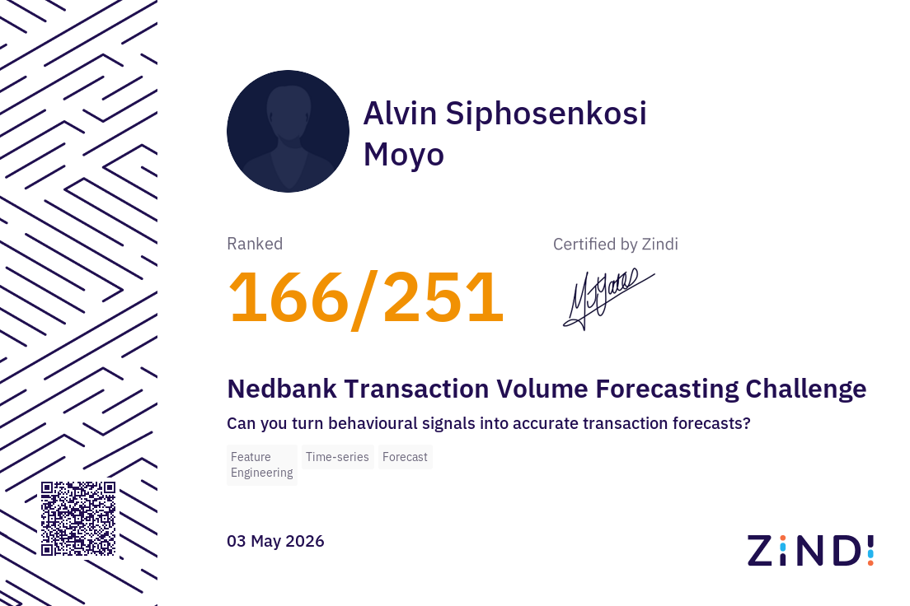
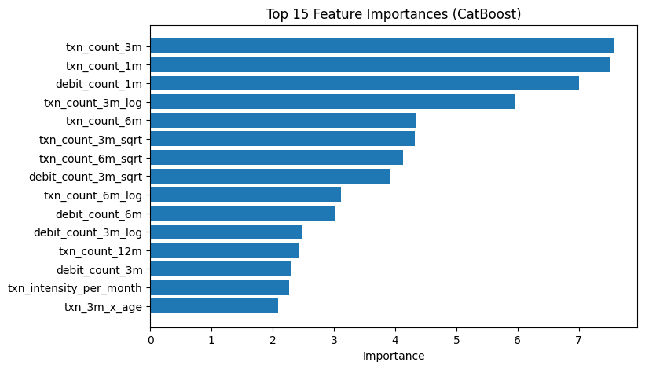

# Nedbank Transaction Volume Forecasting Challenge

> Forecasting customer transaction volumes using 18 million banking records, advanced feature engineering, time-aware validation, and blended gradient boosting models.



---

## Executive Summary

This project was developed for the Zindi and Nedbank Transaction Volume Forecasting Challenge, which required participants to predict the total number of transactions each customer would perform during the next three-month period (November 2015 to January 2016).

The solution transformed approximately 18 million transaction records into a customer-level forecasting dataset using extensive behavioural, financial, demographic, and customer lifetime value (CLV) features. Multiple machine learning models were trained and evaluated using fold-specific target encoding, five-fold cross-validation, and ensemble blending.

The final approach combined XGBoost, CatBoost, and LightGBM with optimized blend weights, later extended with neural network diversity, pseudo-labeling, and hill-climbing experiments.

### Official Results

- **Public Leaderboard RMSLE:** 0.390279
- **Private Leaderboard RMSLE:** 0.392521
- **Final Rank:** 166th out of 251 participants
- **Total Submissions:** 61

Several later experiments achieved lower private scores (~0.388 RMSLE), but these were submitted after the final submission selection deadline and did not affect the official ranking.

This project significantly strengthened my practical understanding of feature engineering, forecasting, ensemble learning, pseudo-labeling, and competitive machine learning using real-world banking data.

---

## Competition Objective

The objective was to predict the variable:

- `next_3m_txn_count`

representing the total number of transactions each customer would make during the next three-month period.

### Evaluation Metric

- **RMSLE (Root Mean Squared Logarithmic Error)**

RMSLE penalizes large proportional errors and is particularly well suited to count forecasting problems with highly skewed target distributions.

---

## Dataset Overview

The competition dataset included:

- **18 million transaction records**
- **372,000 financial snapshot rows**
- **11,944 customer profiles**
- **8,360 labeled training customers**
- **3,584 test customers**

Data sources included:

- Transaction history
- Financial balances
- Customer demographics
- Account characteristics

## Feature Engineering Strategy

To transform raw banking records into predictive customer-level features, extensive feature engineering was performed across multiple time windows and behavioral dimensions.

### Core Behavioural Features

Transaction-level data was aggregated over rolling windows of:

- 1 month
- 3 months
- 6 months
- 12 months

For each period, the following metrics were calculated:

- Transaction counts
- Debit counts
- Credit counts
- Total transaction value
- Absolute transaction value
- Mean transaction amount
- Standard deviation (volatility)
- Minimum and maximum balances

### Recency, Frequency, and Monetary (RFM) Signals

The feature set was designed around the classic RFM framework:

- **Recency:** How recently the customer transacted
- **Frequency:** How often the customer transacted
- **Monetary Value:** The value and volatility of transactions

### Momentum and Trend Features

To capture changes in customer behavior over time, several trend indicators were engineered, including:

- Ratios between short- and long-term activity (e.g. `txn_ratio_3m_12m`)
- Transaction acceleration and deceleration
- Rolling growth rates
- Delta features between time windows

### Seasonality Features

Because the prediction window covered the high-variance holiday period (November–January), specific seasonality features were created to measure:

- November to January transaction volatility
- December transaction spikes
- Holiday uplift relative to baseline activity

### Non-Linear Transformations

To better model skewed distributions and diminishing returns, selected features were transformed using:

- Logarithmic transformations (`log1p`)
- Square-root transformations

Examples include:

- `txn_count_3m_log`
- `txn_count_3m_sqrt`
- `debit_count_3m_log`

### Interaction Features

Interaction terms were added to capture relationships between variables, such as:

- `txn_3m_x_age`
- `balance_per_txn`

### Customer Lifetime Value (CLV) Features

To reflect long-term relationship strength, several CLV-style features were introduced:

- `tenure_days`
- `tenure_months`
- `relationship_value`
- `txn_intensity_per_month`
- `debit_intensity_per_month`

### Categorical Encoding

High-cardinality categorical variables such as city, occupation, industry, and certification type were encoded using fold-specific target encoding to reduce leakage and preserve predictive signal.

### Feature Selection

Permutation importance was used to rank features, and the final models were trained using the top ~75 predictors. This reduced noise, improved generalization, and accelerated training.

---

## Modeling Approach

Multiple complementary algorithms were used to capture different aspects of customer behavior.

### Base Models

- **XGBoost** — Robust gradient boosting with strong handling of non-linear interactions
- **CatBoost** — Excellent performance on heterogeneous financial data
- **LightGBM** — Fast and efficient gradient boosting for large feature sets
- **Neural Network** — Included in later experiments to introduce non-tree model diversity

### Validation Strategy

Five-fold cross-validation was used with:

- `log1p` transformation of the target variable
- Fold-specific target encoding
- Out-of-fold (OOF) prediction generation

This ensured alignment with the RMSLE competition metric and minimized target leakage.

### Hyperparameter Optimization

Optuna was used to tune:

- Model-specific hyperparameters
- Ensemble blending weights

### Advanced Experiments

Several advanced techniques were explored:

- Pseudo-labeling using high-confidence test predictions
- Hill-climbing blend optimization
- Neural network diversity
- Controlled prediction clipping

These experiments improved understanding of generalization and ensemble robustness.

## Final Model Selection & Submission Strategy

Initial experiments showed very similar cross-validation performance across CatBoost, XGBoost, and LightGBM, which motivated the use of balanced ensembles in early submissions.

As the solution evolved—particularly after introducing permutation-based feature pruning, momentum features, seasonality signals, CLV-style features, and expanded hyperparameter tuning—model behaviour began to diverge. CatBoost and LightGBM generally provided the strongest and most stable signals, while XGBoost continued to contribute useful complementary variance.

Optuna was used to jointly optimize both model hyperparameters and ensemble blending weights using out-of-fold (OOF) predictions. The final optimized three-model blend assigned approximate weights of:

- **XGBoost**: ~25%
- **CatBoost**: ~48%
- **LightGBM**: ~27%

Later experiments extended this core ensemble by incorporating:

- A small neural network contribution (~8%) to introduce non-tree model diversity
- Pseudo-labeling using high-confidence test predictions
- Hill-climbing blend optimization based on OOF performance

The official selected submission was a four-model pruned-feature ensemble combining XGBoost, CatBoost, LightGBM, and a neural network diversity component.

Several later experimental submissions achieved stronger private leaderboard scores, but these were submitted after the final submission selection deadline and therefore did not affect the official ranking. This highlighted an important lesson in competitive machine learning: model quality, validation discipline, and submission selection strategy all play critical roles.

All final predictions were clipped to non-negative values and transformed using `np.log1p()` to align with the RMSLE evaluation metric and Zindi submission requirements.

---

## Final Results & Learnings

The official selected submission achieved:

- **Public Leaderboard RMSLE:** 0.390279
- **Private Leaderboard RMSLE:** 0.392521
- **Final Rank:** 166th out of 251 participants
- **Total Submissions:** 61

Several later experimental submissions achieved lower private leaderboard scores around **0.388 RMSLE**, particularly pseudo-labeled and hill-climbing ensembles, but these were submitted after the final submission selection window and therefore did not affect the official ranking.

### Key Technical Learnings

- Short-term behavioural features (1-month and 3-month transaction windows) were consistently the strongest predictors.
- Fold-specific target encoding significantly improved the handling of high-cardinality categorical variables.
- Permutation-based feature pruning reduced noise and improved model stability.
- OOF-based blend optimization produced more robust ensembles than fixed manual weighting.
- Pseudo-labeling and hill-climbing provided useful insights into ensemble generalization.
- Submission selection and deadline management are integral parts of competitive machine learning.

---

## Model Interpretation (Feature Importance)

Feature importance analysis from the averaged CatBoost models across folds reveals that the final model is overwhelmingly driven by short-term behavioural momentum and transaction intensity.

The strongest predictors were:

- **Recent transaction frequency:** `txn_count_3m`, `txn_count_1m`, `txn_count_3m_log`, and `txn_count_3m_sqrt` dominated the top ranks, confirming that near-term activity is the most predictive signal for the next 3-month window.
- **Debit activity intensity:** `debit_count_1m`, `debit_count_3m`, and related transformed features ranked highly, indicating that spending (outflow) behaviour is a strong proxy for customer engagement.
- **Medium-term patterns:** `txn_count_6m` and its transformed variants remained important, helping distinguish whether recent behaviour reflects a sustained trend or a temporary spike.
- **Engagement intensity & CLV-style features:** `txn_intensity_per_month` added meaningful signal by normalising transaction activity relative to customer tenure.
- **Supporting context:** `txn_3m_x_age` provided additional context by capturing the interaction between customer age and recent transaction behaviour.

**Overall Insight:**  
The model strongly validates the principle that “recent behaviour predicts near-future behaviour.” Short-term transaction counts and debit intensity were substantially more informative than static demographic or account attributes.

Permutation importance was used earlier in the pipeline to reduce the feature set to the top ~75 predictors, improving model stability and reducing noise.



---

## Business Impact

Beyond the leaderboard, this solution enables Nedbank to shift from reactive to proactive customer management:

- **Operational Planning:** Accurate transaction volume forecasts support capacity planning, staffing, and infrastructure readiness—especially during the high-variance November–January holiday period.

- **Fraud & Risk Management:** Reliable customer-level behavioural baselines improve anomaly detection and strengthen fraud monitoring.

- **Revenue & Retention:** Early identification of declining transaction momentum enables timely retention campaigns, personalized offers, and proactive engagement before customers reduce activity.

Overall, the model transforms raw behavioural data into actionable intelligence that drives operational efficiency, better risk control, and stronger commercial outcomes.

---

## Technologies Used

- Python
- pandas
- NumPy
- scikit-learn
- XGBoost
- CatBoost
- LightGBM
- Optuna
- category_encoders
- Matplotlib
- Jupyter Notebook

---

## Repository Structure

```text
nedbank-transaction-volume-forecasting/
│
├── README.md
├── requirements.txt
├── .gitignore
│
├── notebooks/
│   └── Nedbank_Transaction_Volume_Forecasting.ipynb
│
├── outputs/
│   ├── zindi_certificate.png
│   └── feature_importance_catboost.png
│
└── README_original_zindi.txt

```
## Future Enhancements

Potential areas for further exploration include:

* TimeSeriesSplit validation for stricter temporal modeling
* Automated feature generation
* Advanced stacking ensembles
* Probabilistic forecasting
* SHAP-based explainability

---

## Acknowledgements

* [Zindi](https://zindi.africa) for hosting the competition
* [Nedbank Group Limited](https://www.nedbank.co.za) for providing the dataset and challenge

```
```

